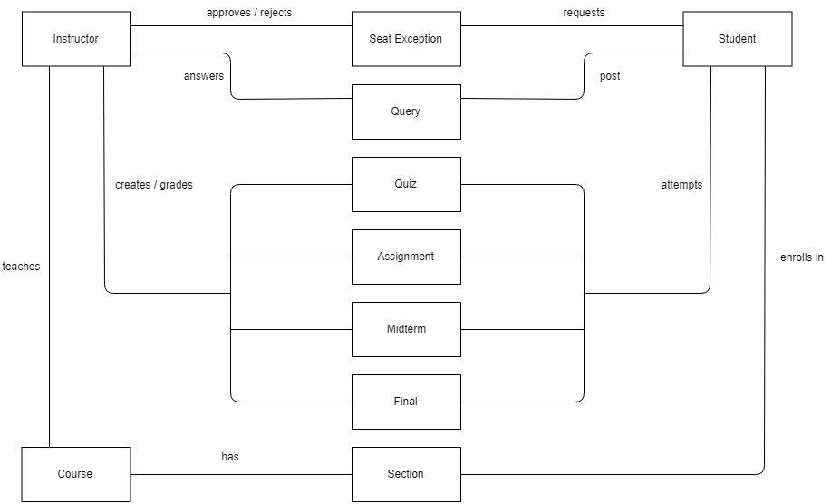
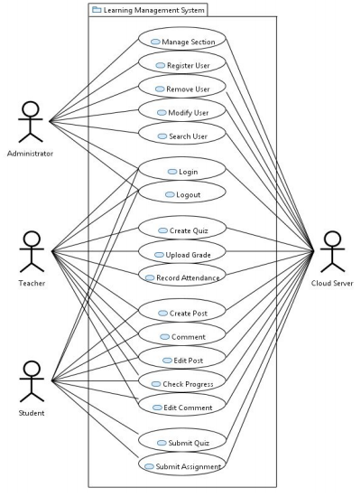
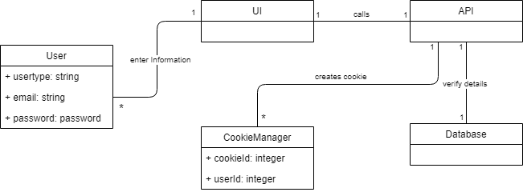
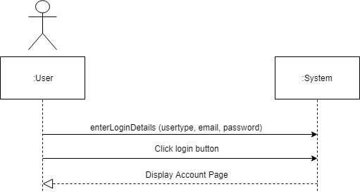
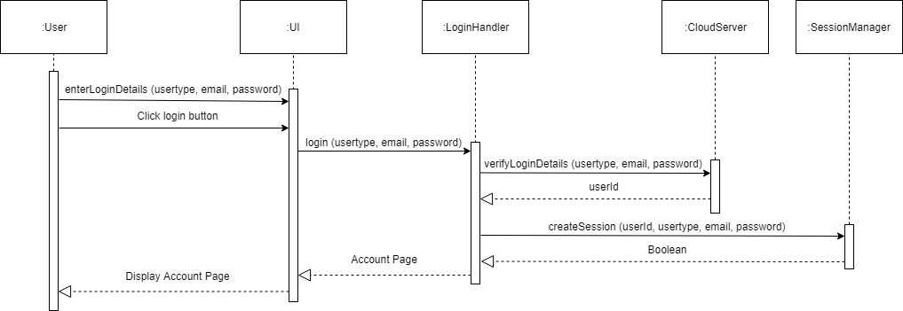
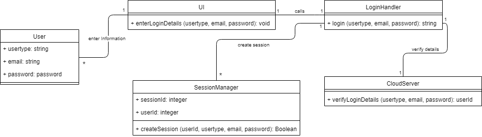
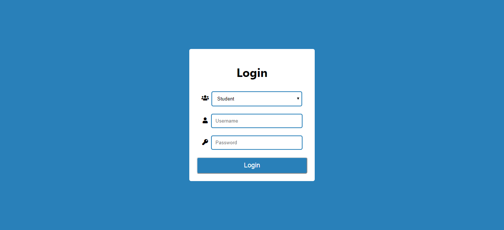

# Learning Management System

As a part of our University Curriculum, we made this project for Object-Oriented Analysis and Design (OOAD) - CSCS 352. This project contains a Software Requirements Specification document, Use Case Diagram with various use cases, and each of them having a Domain Model, System Sequence, Sequence, and Class Diagrams. If you liked the repo do star it.

## Contents
- Description
- Roles
- Basic Structure
	- High Level Domain Model
    - Use Case Diagram
    - Domain Model
	- System Sequence Diagram
	- Sequence Diagram
	- Class Diagram
- Minimal UI

## 1. Description

An LMS is a software application used for the administration and tracking of an educational course. The project handles all the information about the student’s education and learning. Also, it manages resources that were managed and handled by manual manpower previously. The main purpose of the project is to integrate distinct sections of the organization in a consistent manner so that complex functions can be handled smoothly by any technical or non-technical persons. In this case, the organization for which the LMS is being developed is the Aitchison College. The LMS is supposed to handle the educational information of a high school. That means it will cater to all the subjects being offered and all the various sections within the school.

## 2. Roles

- Administrator
- Teacher
- Student

## 3. Basic Structure

**3.1 High Level Domain Model**

    

**3.2 Use Case Diagram**

    

**Note:** All diagrams of other use cases can be found in the `Diagrams` folder. Below are the diagrams for the Login use case.

**3.3 Domain Model**

    

**3.4 System Sequence Diagram**

    

**3.5 Sequence Diagram**

    

**3.6 Class Diagram**

    

## 4. Minimal UI

Other UI images can be found in the `UI` folder. Below is the UI for the Login use case.

Note: UIs were designed only for specific use cases.

    

# Contributors

Do check the contributor to follow some awesome projects

- [@mohammadusman666](https://github.com/mohammadusman666)

`Feel free to fork the repository and contribute to this project.`
